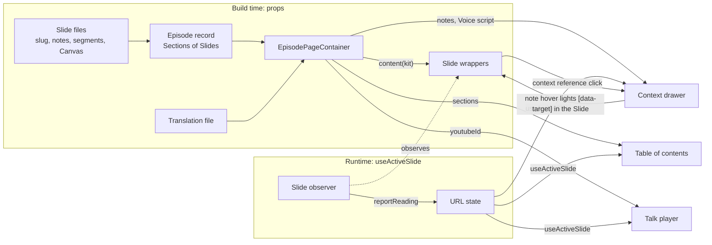

# Episode Page

## Context

Episode = one page: Title slide, then Sections, each a list of Slides whose first, the section slide, names it, beside a table of contents. Every Episode shares this shape, and the Markdown manuscript shares its H1/H2/H3 spine, so a later pipeline can map one onto the other.

**Structure is schema, content is not.** A prototype forced each slide through a typed interface; the agent bent visuals to fit and they degraded. Visualisations need freedom no schema anticipates. One level up it flips: title, Sections, anchors, reading times and table of contents are identical for every Episode, and drift there breaks navigation, translation and the manuscript mapping.

**The Slide is the unit.** A Slide's identity once sat in four hand-kept places (context key, translation path, anchor, record slug) and drifted. Now a Slide file writes its slug once; the rest follows by type or by position:

```
slug 'the-lost-middle', second Slide of Section 'attention'
  → keys    episodes.x.slides.the-lost-middle.*
  → anchor  attention--the-lost-middle
  → heading h3
```

**How it fits.**



**Reference implementation: `src/components/episodes/page-template/`** is the minimal copy source; `slide-layouts/` shows every Slide layout rendered. How to write a Slide lives there and in the agent docs, not here.

## Decision

### 1. One container renders every Episode

1. Only `EpisodePageContainer` MAY emit an Episode's slots, Title slide, Section wrappers, anchors, table of contents, drawer input — all derived from the record, so none can drift.

### 2. The Slide is the unit

1. Each Slide MUST be one file `slides/<slide>.tsx` declaring its slug, minutes, notes, Voice script segments and Canvas; the Episode file only composes Slides into Sections, registered by slug.
2. A Section MUST be a list of Slides whose first, the section slide, names it. Position gives anchors `<section>`, `<section>--<slide>`; slugs are kebab-case, unique per Episode, never `top`.
3. An untitled Slide renders, isn't listed, still counts its minutes; only a titled Slide opens a Section.

### 3. Canvas is free

1. A Canvas MUST be free JSX from the Slide master and layouts; no slide-type union, renderer or schema between it and its markup.
2. The Canvas MUST reach the record only via its kit: `t` reads its Slide's own Translation keys, `ref` and `target` only its declared notes. Never cast.
3. Browser code MUST live in `episodes/<ep>/client/`; Slide files stay server.

### 4. Headings mirror the manuscript

1. One `h1` MUST exist: the Episode title, on the Title slide. Position sets the rest, via the kit's `Title`: `h2` section slide, `h3` page slide; `h4`+ free.
2. Episode files MUST NOT write `h1`–`h3`.

### 5. Strings and anchors keyed by Slide slug

1. Translation keys MUST be flat by Slide slug, never position, no Section level — `episodes.x.slides.intro.title`, not `episodes.x.sections.0.title`. Every locale in one change.
2. Published anchors MUST stay: each Episode snapshots them in `published-anchors.json`; a missing one fails the unit test. Remove one only deliberately.

### 6. Table of contents and Context drawer read the record

1. Table of contents and Context drawer MUST take Slide data from the record and the active Slide from `useActiveSlide()` — never from the DOM.

## Do's and Don'ts

### Do's

1. **DO** start an Episode by copying the `page-template/` folder, in this order: rename the slug; register it in `EPISODE_SLUGS` and the Episode registry; write its Translation keys, en and de, before any Slide file (the types derive from them); then the Slide files; then `published-anchors.json`. (Decision 2, Decision 5)
2. **DO** set `minutes` only on a Slide with a Voice script; the minutes derive from it. No Voice script, no minutes. (Decision 2)
3. **DO** leave `title` off a purely visual Slide. (Decision 2)
4. **DO** build a one-off Canvas from `SlideFrame` and the kit's `<Title>`. (Decision 3, Decision 4)
5. **DO** mark the element a note explains with `{...target('chart')}`. (Decision 3)

### Don'ts

1. **DON'T** render the table of contents, set an anchor `id` or add a route for one Episode. (Decision 1)
2. **DON'T** add a slide-type union or a renderer picking markup from data. (Decision 3)
3. **DON'T** cast a key to make `t`, `ref` or `target` compile. (Decision 3)
4. **DON'T** write `<h2>` in an Episode file. (Decision 4)
5. **DON'T** rename or drop a published slug — it is a shared link. (Decision 2, Decision 5)
6. **DON'T** read a Slide's title, minutes or id from the DOM. (Decision 6)

## Consequences

**Positive:**

1. **Structure right while drafting:** most rules hold by construction or fail in the editor.
2. **Slug written once:** keys, anchor, heading level and kit names follow from it.
3. **One-place change:** a container change reaches every Episode.
4. **Manuscript-ready:** fixed spine and stable slugs let a pipeline target the record without touching design.

**Negative:**

1. **Per-locale minutes double bookkeeping** until a pipeline estimates them.
2. **Many small files:** an Episode is a folder of Slide files, not one page file.

**Risks:**

1. **Structure breaks only visible after build** (duplicate ids, heading order). **Mitigation:** post-build test over every exported Episode, run in CI on every pull request.
2. **A published anchor lost by a rename.** **Mitigation:** the snapshot test names it.

## Compliance and Enforcement

1. **Types:** record, registry, kit and Translation files typed; a missing locale, unregistered slug, foreign key, undeclared note or untitled Section opener fails `tsc`.
2. **Unit tests:** anchor derivation — `top` reserved, duplicate slugs rejected, untitled Slides counted but unlisted; published anchors still produced.
3. **Lint and dependency rules:** Episode files can't write `h1`–`h3`, carry `'use client'` outside `client/`, render the table of contents or import the container.
4. **Post-build test:** every Episode in every locale — slot order, one `h1`, heading level by position, every note target resolves in its Slide, no duplicate ids.

**Manual review duties:** no part reads Slide data from the DOM; a Slide file declares only its own names.

**Exceptions:** raise a separate ADR; human approval required.

## References

- [`GLOSSARY.md`](../../GLOSSARY.md#episode-structure) — Episode structure: Section, Slide, Canvas, Slide master, Slide layout, Voice script.
- [`docs/agents/episode-translation-keys.md`](../../docs/agents/episode-translation-keys.md) — key roles, worked examples.
- [`docs/agents/episode-migration.md`](../../docs/agents/episode-migration.md) — converting a prototype into an Episode, step by step.
- [`docs/agents/episode-page-layout.md`](../../docs/agents/episode-page-layout.md) — table of contents placement, corner allocation, reserved places.
